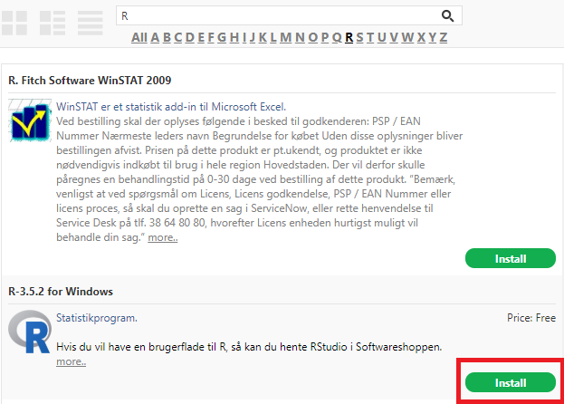
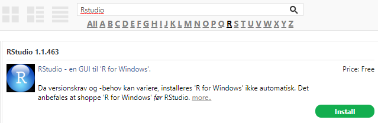
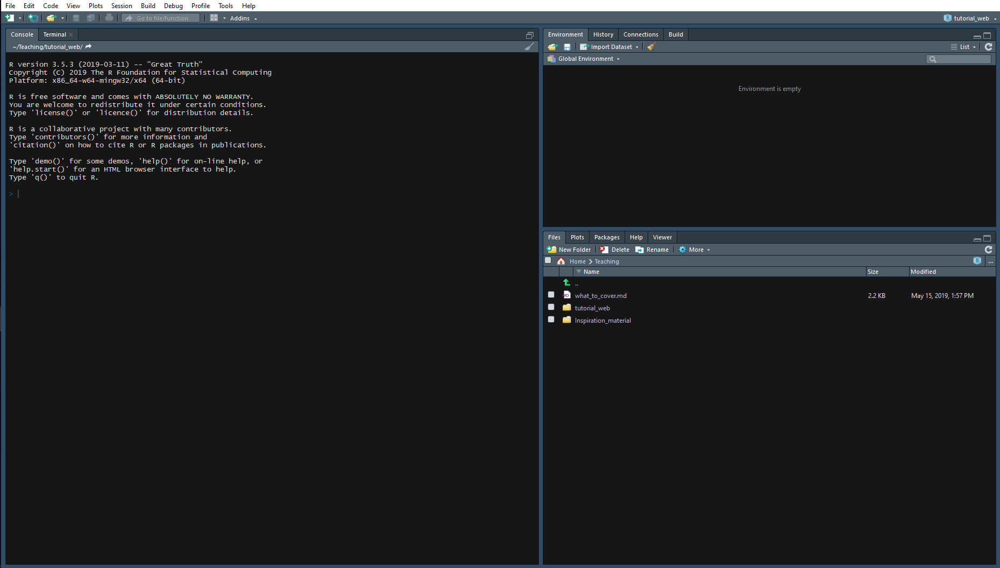

```{r, echo=FALSE}
knitr::opts_chunk$set(error = TRUE, fig.align="center")
```


You want to start learning about Data Science but the information you find online makes you feel like:

<!--  -->

<center></center>
<br/>


This tutorial will guide you to install and set up R and Rstudio in different platforms. Remember to always install R first and then Rstudio to avoid issues. Follow the steps below and in case of questions don't hesitate on using the #R channel in Slack.

# Install R and Rstudio

## Locally in your personal computers

First [download R from its official repository](https://mirrors.dotsrc.org/cran/) and select Linux/Mac/Windows according to your system. For the case of Windows computers click on the __base__ version. Check that the version you are downloading is higher than 3.5. Don't move to the next step util R is sucessfully installed.

Rstudio can be found in the [download section of the official website](https://www.rstudio.com/products/rstudio/download/#download).

## Locally in RegionH computers

Both R and Rstudio are available through "Softwareshoppen". To find R click on **R** under the search bar and scroll down, it should be placed quite on top:



*Rstudio* is easily accessible by using the search bar.


## In Computerome

A lot of software is already available at Computerome and can be [loaded as modules](https://www.computerome.dk/display/CW/Installed+Software). R and Rstudio are already installed in the system but some dependencies are required. Both can be loaded by running the following commands on a terminal:

```bash
module load tools usage_script/1.0
module load intel/compiler/64
module load intel/redist/2019_update2
module load R/3.5.0
module load rstudio/1.1.463
```

These commands can be added to the profile configuration by editing the `~/.bash_profile` file in the home directory and adding the previous lines to the end of the file. If the file does not exist it can be created. For more information on how to do edit this file check [this answer](https://stackoverflow.com/questions/30461201/how-do-i-edit-path-bash-profile-on-osx). After editing the file, restarting the conection with Computerome should load the new profile. Rstudio should be then available by typing `rstudio` in the terminal.

### Virtual enviroments [ADVANCED]

If you are familiar with virtual enviroments you might prefer having your personalised enviroment. This can be done by loading the Anaconda module and installing the enviroment in a specific location (change `user` by your username):

```bash
module load tools
module load anaconda3/4.4.0

conda create --prefix /home/people/user/prog_env anaconda r=3.5.1 r-base rstudio
```
After installation process the enviroment can be loaded by using:

```bash
module load anaconda3/4.4.0; source activate /home/people/user/prog_env
```

To make it easier to load the same command can be added as an alias to the `~/.bash_profile`. This would allow to just type lprogram (or any prefered name) to load the enviroment:

```bash
alias lprogram='module load anaconda3/4.4.0; source activate /home/people/user/prog_env'
```

# Open Rstudio

Open Rstudio and admire your new portal to the future:



Check in the left panel that the R version you installed is correctly loaded. To familiarise yourself with Rstudio check the following video:

<center>
<iframe width="600" height="400" src="https://fast.wistia.net/embed/iframe/520zbd3tij?videoFoam=true" frameborder="0" allowfullscreen></iframe>
</center>

## Pretty coding
Don't get bored and start programming with a nice hacker vibe... 


Rstudio is highly customizable. Go to `Tools > Global Options...` and click in the `Appearance` tab. Here you can select better aesthetics by choosing one of the many themes. It is also recommended to go to the `Code` tab, then `Display` and mark the `[ ] Highlight R functions calls` option.

# R Libraries

R is a open-source project with a worldwide community of developers that contribute with very useful libraries. Now it is the time to install and load the one of the main libraries that we will use through the workshops. We will start by installing the [`tidyverse` library](https://www.tidyverse.org/) by copying the following line in the `Console` panel after the `>`: 

```r
install.packages("tidyverse")
```
Hit Enter and the download and installation process should start. When finished, load the library by executing:

```{r echo=TRUE, message=TRUE, warning=TRUE, paged.print=FALSE, results='asis', collapse=TRUE}
library("tidyverse")
```

Some other libraries that might be useful to install are:

```r
install.packages("openxlsx", "psych")
```

# More information

The main purpose of the following workshops will be to build the conceptual framework that would help you to learn and analyse data with the help of "cheat sheets" that sumarise most of the important information or functions. For the case of Rstudio you can check the following:

+ [Rstudio cheatsheet](https://github.com/rstudio/cheatsheets/raw/master/rstudio-ide.pdf)

For more detailed explanations of R and Rstudio or simply another take of the steps described below please check the following guides.

+ [Chapter 2 of Statistical Inference via Data Science](https://moderndive.com/2-getting-started.html)
+ [Chapter 1.4 of R for Data Science](https://r4ds.had.co.nz/introduction.html#prerequisites)
