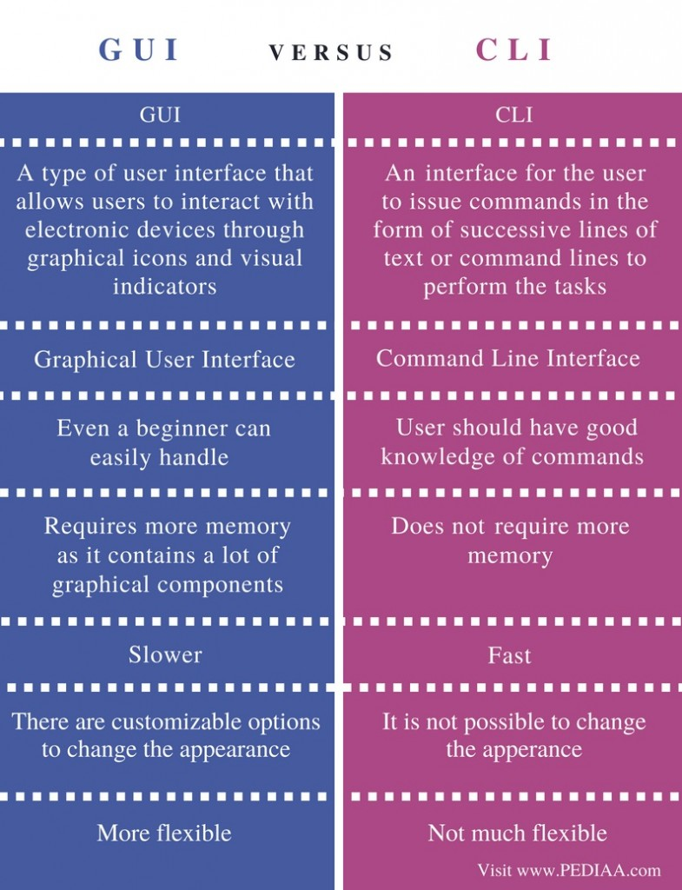

```{r, echo=FALSE}
knitr::opts_chunk$set(error = TRUE, fig.align="center")
```

<style>
body {
text-align: justify}
</style>

---- 


# Demystifying programming

--- 


> Have you ever had only 5 minutes to hack into a high-security intranet to stop nuclear missiles from hitting the ground due to some cyber-terrorist activity?


---


> Well, me neither...

+real+life+-+hacking+involves+thinking.gif)

## What is behind the illusion?

- Speed is achieved by autocompleting with `TAB` and using only the keyboard when shortcuts are known.
- After using the same code over and over you end up memorising it (hopefully).
- Fail fast and often for cheap tasks. Set cheap tests for expensive tasks.

## A dark soulless void with a blinking cursor



## R (CLI) and Rstudio (as "GUI")

+ `Rstudio` as a GUI is also called Integrated Development Environment (IDE). It has a CLI integrated under the `Terminal` tab.
+ `R` is running on the `Console` tab in Rstudio. Which is a CLI or terminal where R as a program has been executed.

> See the [Getting Started](../1_getting_started/t_getting_started.html) for more information

# Operators in R

## A fancy calculator

| Symbol | Description                                            |
|--------|--------------------------------------------------------|
| -      | Minus, can be unary or binary                          |
| +      | Plus, can be unary or binary                           |
| *      | Multiplication, binary                                 |
| /      | Division, binary                                       |
| ^      | Exponentiation, binary                                 |
| %%     | Modulus, binary                                        |
| %/%    | Integer divide, binary                                 |
| %*%    | Matrix product, binary                                 |
| %o%    | Outer product, binary                                  |
| %in%   | Matching operator, binary (in model formulae: nesting) |

----

Other mathematical functions are available such as `exp(x)`, `log(x)`, `sqrt(x)`, `abs(x)`, `round(x, n)`, `sum(x)`, `max(x)`, etc.

## A logical tool

| Symbol | Description                      |
|--------|----------------------------------|
| <      | Less than, binary                |
| >      | Greater than, binary             |
| !      | Negation                         |
| ==     | Equal to, binary                 |
| >=     | Greater than or equal to, binary |
| <=     | Less than or equal to, binary    |
| &      | And, binary, vectorized          |
| &&     | And, binary, not vectorized      |
| `|`      | Or, binary, vectorized           |
| `||`     | Or, binary, not vectorized       |


## A programming language

| Symbol | Description                                              |
|--------|----------------------------------------------------------|
| `#`    | Comment code, it won't execute up to the end of the line |
| `?`    | Get help. e.g `?typeof`                                  |
| `=`    | Left assignment                                           |
| `<-`   | Left assignment, binary                                  |
| `->`   | Right assignment, binary                                 |
| `$`    | List subset, binary                                      |
| `:`    | Sequence or for specifying interaction in models         |

> In R spaces or identation do not matter like in Python

## Common data structures

| Dimensions | Homogeneous | Heterogeneous |
|------------|-------------|---------------|
| 1          | Vector / `c()`,`:`     | List / `list()`          |
| 2          | Matrix / `matrix()`     | Data frame / `data.frame()`    |
| >2         | Array  / `array()`     | Data frame / `data.frame()`    |

**Factors** are a special class of vector that can only contain predefined values. They represent categorical data.

## Indexing

Imagine that:

- `x` is a data structure with multiple elements
- `i` is an index or position in one dimension. It can be a number e.g. 1 (for the first position) or character if positions are named
- `j` is another index for another dimension
- `a` is an element name such a column name in a dataframe

> NOTE: in R vectors start on 1 but in other languages such as Python it can be 0

```r
# For vectors
x[i]
# Matrix or Data frame
x[i, j]
x[, j]
x[i, ]

# For lists and data frames
x[[i]]
x[[i, j]]
x$a

```

## Common data types

| Type in R / `typeof()` | `mode()`    | Examples              |
|----------------------|-----------|---------------------------|
| logical              | logical   | TRUE, FALSE               |
| integer              | numeric   | 1L, 10L, 569L             |
| double               | numeric   | 4.20, 6.9, 1, 10          |
| character            | character | "data", "doctors", "cool" |

An object x type...

- can be tested with `is._(x)` where `_` can be any of the available types. It returns a logical.
- can be coerced to another type if possible using `as._(x)`

## Missing values

+ Missing or unknown values in R are indicated by `NA` (Not Applicable). 
+ Unless removed, operating with "NAs" will yield an NA. 
+ Be careful to not mistake missing values with `NULL` since the last one is a different type with length 0 and without attributes.


## if / else / else if

```r
if ( statement1 ) {
    Do something
} else if ( statement2 ) {
    Do something else
} else if ( statement3 ) {
    Do something else
} else {
    Do something else
}
```

+ The statement used must return a logical (`TRUE` or `FALSE`). eg `x > 5` or `patient == "sick"`
+ When there is a explicit condition defined one must use `if` or `else if` (for more than logical condition). 
+ `else` conditional will execute when the defined condition is not met.
+ If we have a list of options then the function [`switch`](https://cran.r-project.org/doc/manuals/R-lang.html#switch) can be used.

## Looping

```r
# Risky due to unknown number of iterations
while ( statement1 ) {
    DO stuff until statement1 is FALSE
}

# Better use a for loop
for ( element in sequence ) {
    Do stuff based on element
}
```

There are extra controls for the loops:

+ `break` : exit the current loop that is being executed
+ `next` : starts the next iteration immediately from the beginning of the current loop.

## Special functions in R for looping

These are functions that apply a function (`FUN`) to each element of a different data structure (`x`):

+ `apply(X, MARGIN, FUN, ...)` where x is a matrix or dataframe, margin can be 1 to process rows and 2 for columns.
+ `lapply(X, FUN, ...)` where x can also be list and it returns a list.
+ `sapply(X, FUN, ...)` where x can also be a list but it returns a vector.

> These are more efficient and fast ways to iterate in R. Always use if possible.

## Functions

```r
myfunction <- function ( argument1 = value1, argument2 = value2, ... ) {

    result = execute based on argument1 or argument2...
  
    return( result )
}
```

+ Arguments are passed as a list
+ `return()` is not necessary if the function just executes operations that are shown or elements stored outside the function

## Object-oriented programming (OOP) vs Functional programming

Different styles of building the structure and elements of computer programs. Inspired from Wikipedia:

- **Object-oriented programming (OOP)** is based on the concept of **"objects"** (often known as classes), which **can contain data**, in the form of fields (often known as **attributes** or properties), and code, in the form of procedures (often known as methods).
- **Functional programming (FP)** treats computation as the evaluation of mathematical **functions** and **avoids changing-state and mutable data**. The output value of a function depends only on its arguments, so calling a function with the same value for an argument always produces the same result.

In R:

+ Everything that exists is an object.
+ Everything that happens is a function call.

## Packages or libraries

+ Due to the open-source nature of R, members of the community create collections of code, data, objects and/or functions available for everybody else. 
+ These are are provided as packages and stores in repositories (being `CRAN` the main one). 
+ Packages can be installed by using `install.packages("package_of_interest")` and loaded in the beginning of a session by executing `library("package_of_interest")`

## Bibliography

+ [Basic R cheatsheet](http://github.com/rstudio/cheatsheets/raw/master/base-r.pdf)
+ [Advanced R](https://adv-r.hadley.nz)
+ [R language manual](https://cran.r-project.org/doc/manuals/R-lang.html)
+ [Awesome R- Curated list of R packages](https://awesome-r.com/)
+ [OOB, FP and R](https://projecteuclid.org/download/pdfview_1/euclid.ss/1408368569)

## Proposed exercise

Using all the elements described, let's make a function that estimates the ten-year risk of fatal cardiovascular disease in Europe based on the SCORE project. [Click here for the instructions in the paper, Appendix A](https://academic.oup.com/eurheartj/article/24/11/987/427645#89243104)

>Conroy, R. M. et al. Estimation of ten-year risk of fatal cardiovascular disease in Europe: the SCORE project. Eur Heart J 24, 987–1003 (2003).

To simplify, just focus on one type of patients such as Non-CHD CVD and low risk.

You can compare your results based on the provided charts by the [European Society of Cardiology](https://www.escardio.org/Education/Practice-Tools/CVD-prevention-toolbox/SCORE-Risk-Charts)

## Tips

+ Copy and paste the syntax
+ Use the cheat sheet as a guide
+ Use if/else statements for the different cases
+ Create an example of a patient as a vector or a list
+ If you feel adventurous create multiple examples and run them by using a loop or even better with the `apply()` family


<!---

factor?
logical
NULL

as.something

-->

